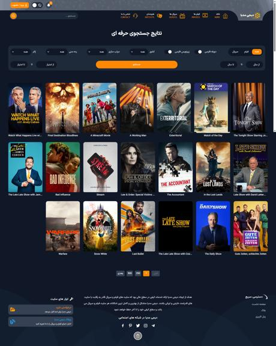

# وب‌سایت نمونه کار: digi media

 
 

این وبسایت یک سایت معرفی فیلم و سریال میباشد که با استفاده از  api (tmdb) و به عنوان نمونه کار طراحی شده

## 🔗 لینک دمو
<h2>توجه: جهت نمایش عکس ها با vpn از سایت بازدید کنید</h2>
<a href="https://amirrezazade.github.io/digi-media/" target="_blank">مشاهده وب‌سایت به صورت زنده</a>

---
##  جزِیات سایت 
- سایت شامل 6 صفحه میباشد که شامل صفحه اصلی ,  صفحه مخصوص هر فیلم , صفحه مخصوص سریال , صفحه اشخاص , صفحه جستجوی حرفه ای و صفحه ورود یا ثبت نام میباشد
- دارای تم روشن و تاریک 
---

## 🛠️ تکنولوژی‌های استفاده شده

- tailwind css : ...استایل‌دهی و طراحی ظاهری سایت، شامل انیمیشن‌ها و ترنزیشن‌ها و
- SwiperJS :برای ایجاد اسلایدر های حرفه ای و زیبا 
- TMDB : برای دریافت اطلاعات فیلم ها, سریال ها , اشخاص و جستجوی حرفه ای


## 🚀 نحوه راه‌اندازی پروژه

اگر می‌خواهید این پروژه را به صورت محلی اجرا کنید، مراحل زیر را دنبال کنید:

1. ریپازیتوری را کلون کنید:
   
   ```bash
   https://github.com/amirRezazade/digi-media.git
